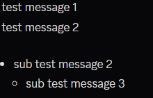
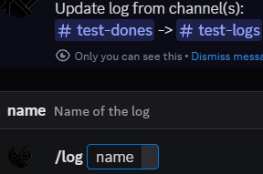

## Setting up config
Make sure to get [.Net 10](https://aka.ms/dotnet-core-applaunch?framework=Microsoft.NETCore.App&framework_version=10.0.0&arch=x64&rid=win-x64&os=win10)

First is to extract the zip/rar into a folder.

Run 'KBDiscordUpdateLog.exe' inside the folder

A 'Config' folder should appear as the prompt saying 'Token or config is empty'

Open up 'config.json' in any text editor:
 - `Token` is the bot token you need to input from discord developer portal of the chosen bot(might be too lengthy to explain this process).
 - `OperatorIds` your user id obtained from right clicking your profile and 'Copy User Id' with developer mode on in Settings > Advanced, allow usage of the `/log` command. Example below on how to add:
```json
"OperatorIds": [
  "1234567890",
],
```
 - `MessageLogLimit` how many messages should the bot check starting from most recent message
```json
{
  "ChannelLog": "",
  "ChannelPublish": "",
  "RecentTimeStamp": "0"
},
```
More log channels can be added by simply adding more of the above into the LogChannel, Reminder to have a ',' at the end of every array.
 - `ChannelLog` the channel where developer is posting log/update
 - `ChannelPublish` the channel where bot publish log

To get a channel id for the property above: Go into your discord settings > Advanced > Turn on developer mode, now right click on the desired channel and Click 'Copy Channel ID' and you can use the ID for 'ChannelLog' or 'ChannelPublish'

## Message logging
Any new message since bot first start up will be logged



use /log to log messages into an embed



Note will be publish like below

